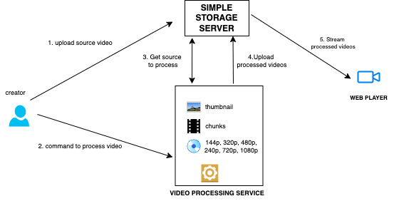

# Video streaming system

Simple end to end video streaming system , based on **HLS (HTTP Live Streaming)** Protocal for experimental purpose. Using **FFMPEG** different resolutions of the video will be generated and chunks will be chopped for all resolutions. And thumbnail also created. Finally these chunks of different resolutions will be streamed. **Based on the internet bandwidth**, chunks are automatically fetched in the player.

https://user-images.githubusercontent.com/42114351/151689745-820a23a7-b657-4766-a82f-7f3c3b0a438c.mp4

## Flow Diagram




## Steps to start in local

### 1. Initiate all services and jobs

- Need to start **simple-storage-server**, first. Go inside the folder , and after installing all dependencies from pipenv, start by
  ```pipenv run start```
- Copy the url, will need it later.
- Second one is , **video-processing-service**. Export environment variable named **STORAGE_SERVER_URL** with the value of above url. Go inside the folder , and after installing all dependencies from pipenv, start by
  ```pipenv run start```
- Finally start the web-player react app, by ```npm start``` after exporting the same environment variable in the .env file of web-player (**REACT_APP_STORAGE_SERVER_URL**). Initially there will be no any video.


### 2. Create the first stream

- Post your source video.

```
curl --location --request POST 'http://{simple-storage-server-url}/uploadSource' \
--header 'Content-Type: multipart/form-data' \
--form 'file=@absolute_video_file_path' \
--form 'video_id=my_first_video_to_stream'
```

you will get response like , ```{
    "message": "File uploaded vidd.mp4"
}```

- Process the video. (video format should be the source video's format)

```
curl --location --request POST 'http://{video-processing-service-url}/process-video' \
--header 'Content-Type: application/json' \
--data-raw '{
	"video_id":"my_first_video_to_stream",
	"video_format":"my_first_video_to_stream_format(mp4,mkv..etc)"
}'
```

- It will take some time based on video size. for 50 mb video , it took 1 min while testing. So wait for some time.

you will get response like , ```{
    "message": "Video processed successfully"
}```

- After that , if you refresh the web-player page , your video will be visible.

## Todo

- Choosing resolutions manually.


